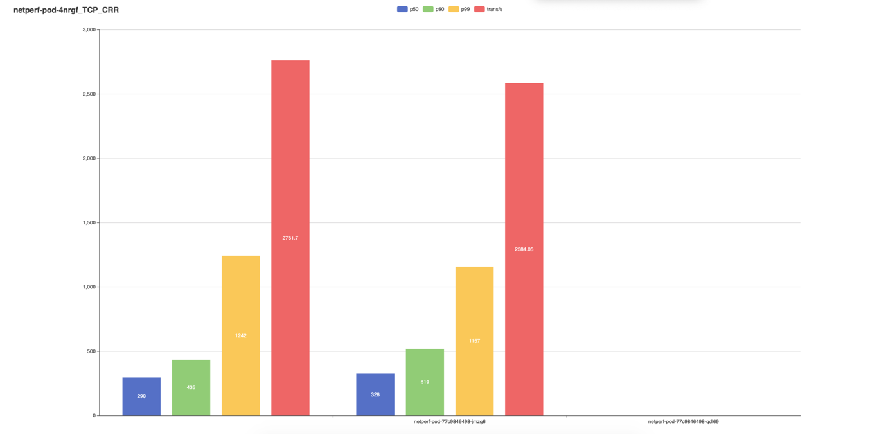

# Perftest

This is a simple but functional testing tool to measure the network performance of a kubernetes cluster.
It uses K8s-SIG approved network performance tools.
So far it uses `iPerf` and `netperf` to run tests.

### How it works?
It has two components, a client(cli) and a server.
It works by deploying a netperf client/server daemonset and single replica deployment.
Each acts simultaneously as client and server so can be used to generate performance metric out from each to other members.
The client(cli) once built logs in to each of the pods and runs perftest across its peers, gets the results, collates them 
beautifully to stdout and csv and into html graphs.


### How to use? 

1. Deploy the manifests using the provided makefile. Run ```
```
   make kubernetes
```
2. Build the cli again with makefile. 
```
    # For mac use 
    make build
    # For linux
    make build-linux
```
3. To run test now trigger the following commands.
4. To run all tests with graph and stdout output `./perftest -run all -stdout true -graph true`. This generates csv files and bar graphs based on the same.
5. To run specific tests or disable stdout/graph `./perftest -run iperf,netperf -stdout false -graph false`. This exact command only generates CSVs.

### Outputs

The stdout result looks like this --> 
```
                       Podname                                           p50     90       p99    Trans/s
================================================================        =====   =====   =====   =======
netperf-pod-4nrgf                                                        79      199     300     8211.83
netperf-pod-77c9846498-qdl69                                             79      131     248     10240.09
#####    Output from pod netperf-pod-77c9846498-qdl69 for netperf test in TCP_RR mode    #####
                       Podname                                           p50     90       p99    Trans/s
================================================================        =====   =====   =====   =======
netperf-pod-4nrgf                                                        80      180     286     8987.86
netperf-pod-77c9846498-jmzg6                                             194     250     452     5337.32

```

The output CSVs look like this
```
#> cat netperf-pod-4nrgf_TCP_CRR.csv
netperf-pod-4nrgf,p50,p90,p99,trans/s
netperf-pod-77c9846498-jmzg6,298,435,1242,2761.7
netperf-pod-77c9846498-qdl69,328,519,1157,2584.05
```
The output graphs(html formatted looks the part)


